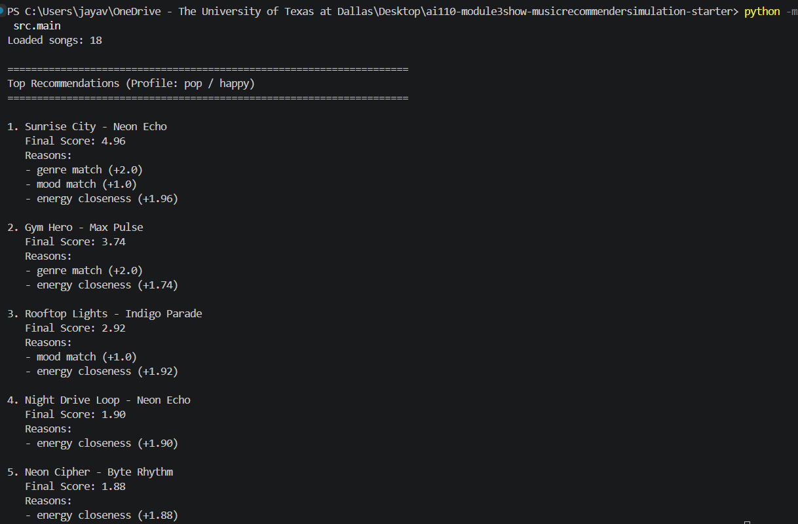
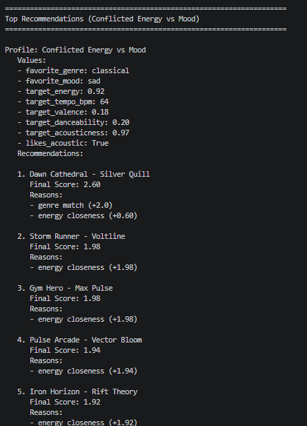
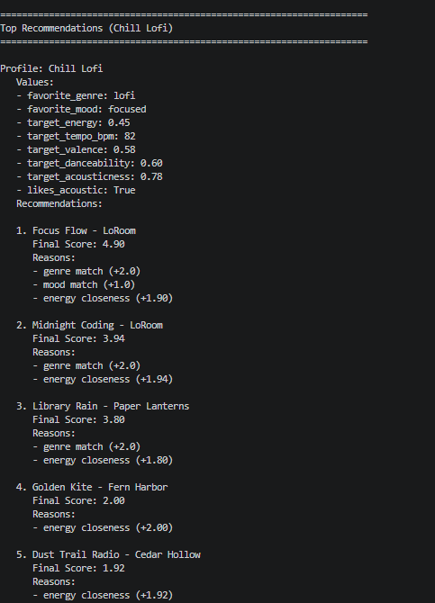
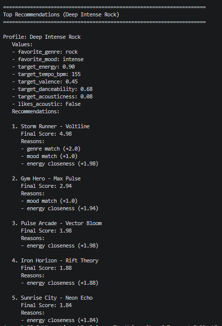
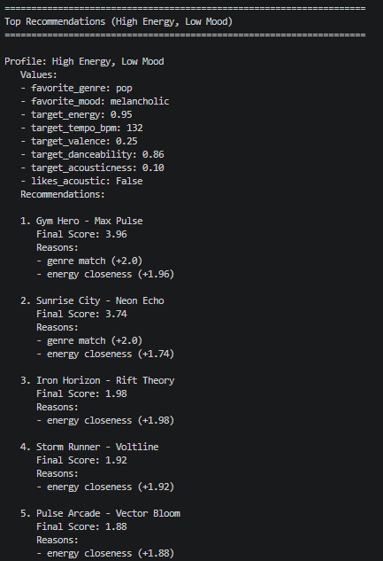
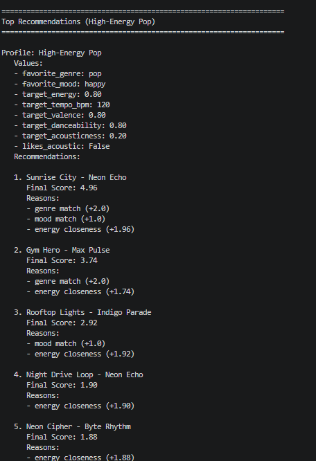

# 🎵 Music Recommender Simulation

## Project Summary

This project builds a simple music recommender from a small song catalog. It compares each song to a user profile and ranks songs by a point-based score. I used this project to test how weight choices change recommendation behavior.

---

## How The System Works

Explain your design in plain language.

Some prompts to answer:

- What features does each `Song` use in your system
  - For example: genre, mood, energy, tempo
- What information does your `UserProfile` store
- How does your `Recommender` compute a score for each song
- How do you choose which songs to recommend

You can include a simple diagram or bullet list if helpful.

Each song has genre, mood, energy, and tempo.
Each profile has favorite genre, favorite mood, target energy, and target tempo.
The score adds points for exact genre and mood matches.
It also adds closeness points for energy and tempo.
Then songs are sorted from highest score to lowest score and the top k songs are returned.

Current scoring summary:
- Genre match: +2.0
- Mood match: +1.0
- Energy closeness: up to +4.0
- Tempo closeness: up to +2.0

## Getting Started

### Setup

1. Create a virtual environment (optional but recommended):

   ```bash
   python -m venv .venv
   source .venv/bin/activate      # Mac or Linux
   .venv\Scripts\activate         # Windows

2. Install dependencies

```bash
pip install -r requirements.txt
```

3. Run the app:

```bash
python -m src.main
```

To run one specific profile:

```bash
python -m src.main --profile "High-Energy Pop"
```

To list profile names:

```bash
python -m src.main --list-profiles
```

### Running Tests

Run the starter tests with:

```bash
pytest
```

You can add more tests in `tests/test_recommender.py`.

---

## Experiments You Tried

Use this section to document the experiments you ran. For example:

- What happened when you changed the weight on genre from 2.0 to 0.5
- What happened when you added tempo or valence to the score
- How did your system behave for different types of users


- I reduced genre weight and increased energy weight.
- I added tempo scoring to the ranking function.
- I tested multiple profiles: High-Energy Pop, Chill Lofi, Deep Intense Rock, Conflicted Energy vs Mood, Alias Mismatch, and Boundary Case Zero Energy.
- I observed that high-energy songs can appear across very different profiles.

---

## Limitations and Risks

Summarize some limitations of your recommender.

Examples:

- It only works on a tiny catalog
- It does not understand lyrics or language
- It might over favor one genre or mood

You will go deeper on this in your model card.


- The catalog is very small (18 songs).
- Several features in the data are not used in scoring (valence, danceability, acousticness).
- Strong energy weighting can create repeated high-energy recommendations.
- Exact-label matching can miss near matches (for example, related subgenres).

---

## Reflection

Read and complete `model_card.md`:

[**Model Card**](model_card.md)

Write 1 to 2 paragraphs here about what you learned:

- about how recommenders turn data into predictions
- about where bias or unfairness could show up in systems like this


I learned that simple scoring rules can still feel like real recommendations when top songs match the user vibe. I also learned that this can be misleading, because the model only uses a few features and can ignore other parts of taste.

I saw bias show up when one feature gets too much influence. In my case, strong energy weighting made some songs, like Gym Hero, appear for profiles that were different in mood or genre.

---



Profile 1:


Profile 2:


Profile 3:


Profile 4:


Profile 5:
